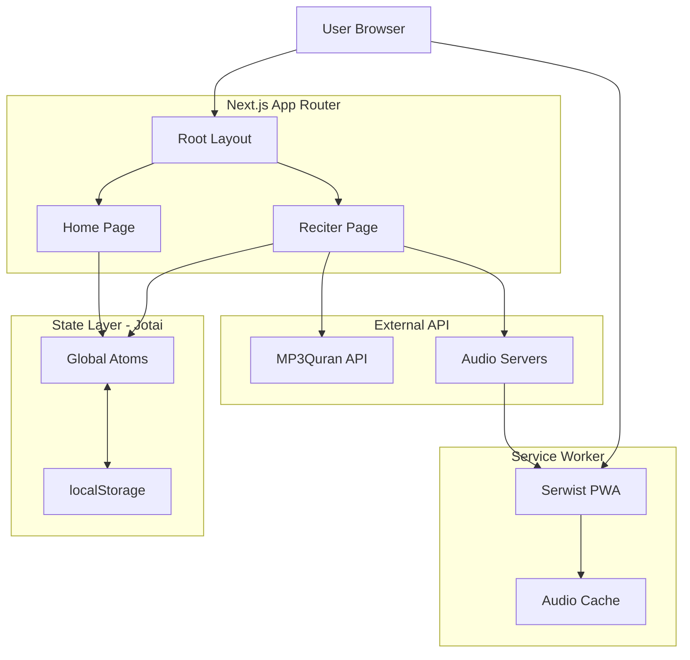

## Application Architecture

Open Tarteel is built as a Progressive Web App (PWA) using Next.js 15 with React 19, designed to provide offline-first Quran streaming capabilities.

### Technology Stack

<CardGroup cols={2}>
  <Card title="Frontend Framework" icon="react">
    - Next.js 15.4.2 with App Router
    - React 19.1.0 with Server Components
    - TypeScript 5 for type safety
  </Card>
  
  <Card title="State Management" icon="atom">
    - Jotai 2.11.1 for atomic state
    - localStorage persistence
    - Jotai DevTools for debugging
  </Card>
  
  <Card title="Styling" icon="palette">
    - Tailwind CSS 3.4.1
    - Tailwind Animated
    - Custom CSS variables
  </Card>
  
  <Card title="PWA Features" icon="mobile">
    - Serwist 9.0.12 service worker
    - Offline audio caching
    - Install prompts
  </Card>
</CardGroup>

### Architecture Diagram



### Project Structure

<CodeGroup>
```bash Directory Structure
src/
├── app/                    # Next.js App Router
│   ├── layout.tsx         # Root layout with providers
│   ├── page.tsx           # Home page with reciter selector
│   ├── manifest.ts        # PWA manifest configuration
│   ├── reciter/[id]/     # Dynamic reciter pages
│   ├── about/            # Static pages
│   └── api/              # API routes
├── components/            # React components
│   ├── player.tsx        # Audio player component
│   ├── player-controls.tsx
│   ├── reciter-selector.tsx
│   └── audio-bars-visualizer.tsx
├── jotai/                # State management
│   ├── atom.ts           # Global atoms
│   └── create-atom-with-storage.ts
├── utils/                # Utility functions
│   ├── api.ts            # API integration
│   └── storage/          # Storage helpers
├── types/                # TypeScript types
└── sw.ts                 # Service worker
```
</CodeGroup>

### Core Features

<AccordionGroup>
  <Accordion title="Server-Side Rendering (SSR)">
    Next.js App Router provides:
    - Initial page load optimization
    - SEO-friendly reciter pages
    - Automatic code splitting
    - Image optimization
    
    ```typescript src/app/reciter/[id]/page.tsx
    export default async function ReciterPage({ params }) {
      // Server-side data fetching
      const reciter = await getReciter(params.id);
      return <ReciterPageClient reciter={reciter} />;
    }
    ```
  </Accordion>
  
  <Accordion title="Client-Side Hydration">
    React components hydrate on the client with:
    - Jotai state restoration from localStorage
    - Audio player initialization
    - Service worker registration
    
    ```typescript src/app/layout.tsx
    'use client';
    export default function RootLayout({ children }) {
      const [isFullscreen, setIsFullscreen] = useAtom(fullscreenAtom);
      // Sync fullscreen state with browser
      useEffect(() => {
        document.addEventListener('fullscreenchange', onFullscreenChange);
      }, []);
    }
    ```
  </Accordion>
  
  <Accordion title="Progressive Enhancement">
    The app works without JavaScript but enhances with:
    - Audio playback controls
    - Offline caching
    - Real-time visualizers
    - Keyboard shortcuts
  </Accordion>
</AccordionGroup>

### Configuration Files

<Tabs>
  <Tab title="Next.js Config">
    ```typescript next.config.ts
    import withSerwistInit from '@serwist/next';
    import withBundleAnalyzer from '@next/bundle-analyzer';
    
    const withSerwist = withSerwistInit({
      swSrc: 'src/sw.ts',
      swDest: 'public/sw.js',
      cacheOnNavigation: true,
      disable: !isProduction,
      maximumFileSizeToCacheInBytes: 100 * 1024 * 1024, // 100MB
    });
    
    const nextConfig: NextConfig = {
      reactStrictMode: !isProduction,
      transpilePackages: ['jotai-devtools'],
      compiler: {
        removeConsole: isProduction && { exclude: ['error'] },
      },
    };
    ```
  </Tab>
  
  <Tab title="TypeScript Config">
    ```json tsconfig.json
    {
      "compilerOptions": {
        "target": "ES2020",
        "lib": ["dom", "dom.iterable", "esnext"],
        "allowJs": true,
        "skipLibCheck": true,
        "strict": true,
        "noEmit": true,
        "esModuleInterop": true,
        "module": "esnext",
        "moduleResolution": "bundler",
        "resolveJsonModule": true,
        "isolatedModules": true,
        "jsx": "preserve",
        "incremental": true,
        "paths": {
          "@/*": ["./src/*"]
        }
      }
    }
    ```
  </Tab>
  
  <Tab title="Package.json Scripts">
    ```json package.json
    {
      "scripts": {
        "dev": "next dev",
        "dev:turbo": "next dev --turbopack",
        "build": "next build",
        "start": "next start",
        "lint": "next lint",
        "type-check": "tsc --noemit"
      }
    }
    ```
  </Tab>
</Tabs>

### Performance Optimizations

<CardGroup cols={2}>
  <Card title="Bundle Size" icon="box">
    - Code splitting per route
    - Dynamic imports for heavy components
    - Tree shaking unused code
    - Bundle analyzer integration
  </Card>
  
  <Card title="Caching Strategy" icon="database">
    - Static assets cached indefinitely
    - API responses cached 1 hour
    - Audio files cached 7 days
    - Service worker precaching
  </Card>
  
  <Card title="Network Optimization" icon="wifi">
    - Lazy loading images
    - Preconnect to MP3Quran servers
    - HTTP/2 server push
    - Compression (Brotli/gzip)
  </Card>
  
  <Card title="Runtime Performance" icon="bolt">
    - React 19 concurrent features
    - Jotai atomic updates
    - Web Workers for audio processing
    - RequestIdleCallback for non-critical tasks
  </Card>
</CardGroup>

<Note>
  **Production Mode**: In production, the app removes console logs (except errors), enables strict mode optimizations, and activates the service worker for offline support.
</Note>

## Development Workflow

```bash
# Install dependencies
npm install

# Development server with Turbopack
npm run dev:turbo

# Type checking
npm run type-check

# Production build
npm run build

# Analyze bundle size
ANALYZE=true npm run build
```

### Browser Support

<Tabs>
  <Tab title="Supported">
    - Chrome/Edge 90+
    - Firefox 88+
    - Safari 14+
    - Mobile browsers (iOS Safari, Chrome Android)
  </Tab>
  
  <Tab title="Required Features">
    - Service Worker API
    - Cache Storage API
    - Web Audio API
    - localStorage
    - Fetch API
    - ES2020+ JavaScript
  </Tab>
</Tabs>

<Check>
  The architecture is designed for scalability, offline-first capabilities, and optimal performance across all devices.
</Check>